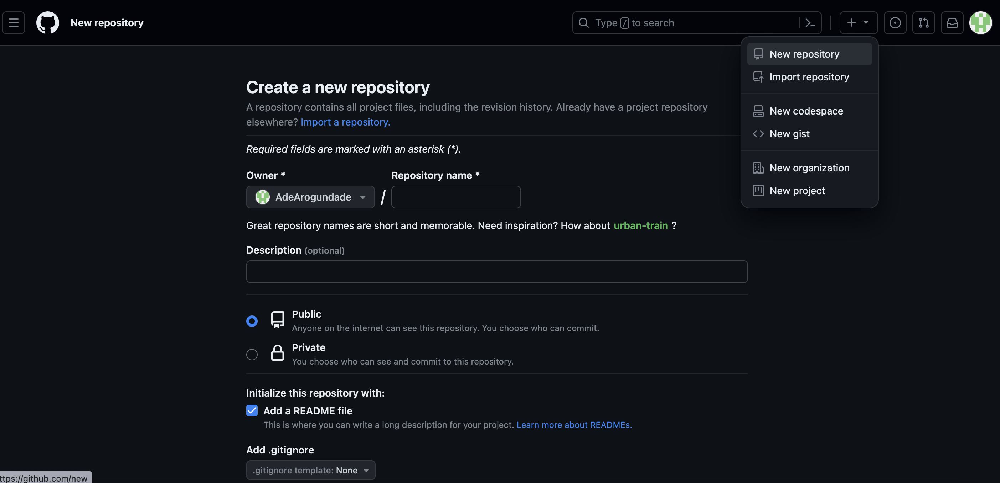
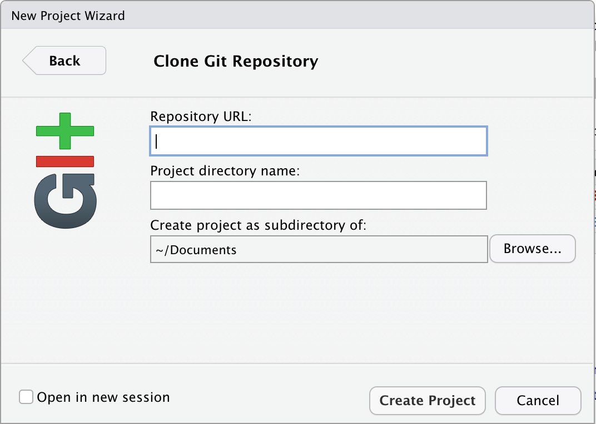
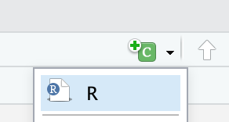

--- 
title: "EEB 605 Bioinformatics Tutorial"
subtitle: "Tutorial on GitHub"
author: "Katherine Kappelman, Mike Kramer-Duffield, and Adedotun Arogundade"
date: "`r Sys.Date()`"    # Instead of writing date, we use an inline code of R for it to update the code with the system's date each time you knit
output:
  bookdown::html_document2:   #We specified that we want to use the html_document2 function from bookdown to avoid any ambiguity
    toc: TRUE
 # bookdown::pdf_document2:        #### # I added hashtag at the beginning of this code because I dont have latex installed on the computer.
  #  toc: TRUE
    toc_float: yes
    toc_depth: 6
link-citations: yes   # This function is used to link your in-text citations so that when clicked it will redirect readers to the full-text references
fontsize: 12pt
bibliography: Bibliography_Reproducible_Science_2.bib  
csl: AmJBot.csl
---


<!-- LOAD PACKAGES -->

```{r packages, echo = FALSE, warning=FALSE, include=FALSE}
###~~~
# Load R packages
###~~~
#Create vector w/ R packages
# --> If you have a new dependency, don't forget to add it in this vector
pkg <- c("knitr", "rmarkdown", "bookdown", "formattable", "kableExtra", "dplyr", "magrittr", "prettydoc", "htmltools", "knitcitations", "bibtex", "devtools")

##~~~
#2. Check if pkg are installed
##~~~
print("Check if packages are installed")
#This line outputs a list of packages that are not installed
new.pkg <- pkg[!(pkg %in% installed.packages())]

##~~~
#3. Install missing packages
##~~~
# Using an if/else statement to check whether packages have to be installed
# WARNING: If your target R package is not deposited on CRAN then need to adjust code/function
if(length(new.pkg) > 0){
  print(paste("Install missing package(s):", new.pkg, sep=' '))
  install.packages(new.pkg, dependencies = TRUE)
}else{
  print("All packages are already installed!")
}

##~~~
#4. Load all packages
##~~~
print("Load packages and return status")
#Here we use the sapply() function to require all the packages
# To know more about the function type ?sapply() in R console
sapply(pkg, require, character.only = TRUE)


# Generate BibTex citation file for all loaded R packages
# used to produce report Notice the syntax used here to
# call the function
knitr::write_bib(.packages(), file = "packages.bib")

```

<!-- SET GLOBAL OPTIONS -->

```{r setup, include = FALSE, cache = FALSE, message = FALSE}

# Load packages
## Add any packages specific to your code
library("knitr")
library("bookdown")

# Set your working directory

setwd("~/EEB_603_Tutorial_Fall2023")

# Chunk options: see http://yihui.name/knitr/options/ ###
## Text results
opts_chunk$set(echo = TRUE, warning = TRUE, message = TRUE, include = TRUE)
## Code decoration
opts_chunk$set(tidy = TRUE, tidy.opts = list(blank = FALSE, width.cutoff = 60),
    highlight = TRUE)

## Plots The first dev is the master for the output
## document
opts_chunk$set(fig.path = "Figures_MS/", dev = c("png", "pdf"),
    dpi = 300)
## Locate figures as close as possible to requested
## position (=code)
opts_chunk$set(fig.pos = "H")


```


# DAY 1

## Learning Objectives

* Learn how to create a github account

* Download and Install and git

* Learn how to set up git with your user name and email.


## Setting Up

### Creating a GitHub Account

First, we need to create a GitHub account. Visit the [GitHub](github.com) page to register with a valid email address and create an account for free.


### Install Git and R studio

Download and install [Git](https://git-scm.com/downloads) on your local computer. If you do not already have R studio, download R and R studio using this [link](https://www.rstudio.com/products/rstudio/download/).

### Set your R Terminal to Git Bash.

Make sure your settings are up to date by going to **Tools** --> **Global Options** --> **Terminal** --> under the **General Tab** --> **New Terminals Open with: GitBash** --> **Apply**.

### Install Visual Studio {#Install_Visual_Studio}

Finally, you will need to install Visual Studio Code on your personal computers by downloading Visual Studio Code from this [link](https://code.visualstudio.com/download).


## GitHub Terminologies {#GitHub_Terminologies}

Understanding GitHub terminology can make the GitHub experience easier and more meaningful. Here are some terms that you will come across during this tutorial. Click [here](https://docs.github.com/en/get-started/quickstart/github-glossary) for a complete glossary of github terminologies.

* **Branch :** A branch is a parallel version of a repository. It is contained within the repository, but does not affect the primary or main branch allowing you to work freely without disrupting the "live" version. When you've made the changes you want to make, you can merge your branch back into the main branch to publish your changes.

* **Clone :** A clone is a copy of a repository that lives on your computer instead of on a website's server somewhere, or the act of making that copy. When you make a clone, you can edit the files in your preferred editor and use Git to keep track of your changes without having to be online. The repository you cloned is still connected to the remote version so that you can push your local changes to the remote to keep them synced when you're online.

* **Collaborator :** A collaborator is a person with read and write access to a repository who has been invited to contribute by the repository owner.

* **Commit :** A commit, or "revision", is an individual change to a file (or set of files). When you make a commit to save your work, Git creates a unique ID (a.k.a. the "SHA" or "hash") that allows you to keep record of the specific changes committed along with who made them and when. Commits usually contain a commit message which is a brief description of what changes were made.

* **Commit ID :** Also known as SHA. A 40-character checksum hash that identifies the commit.

* **Commit message :** Short, descriptive text that accompanies a commit and communicates the change the commit is introducing.

* **Default Branch :** The base branch for new pull requests and code commits in a repository. Each repository has at least one branch, which Git creates when you initialize the repository. The first branch is usually called main, and is often the default branch.

* **Diff :** A diff is the difference in changes between two commits, or saved changes. The diff will visually describe what was added or removed from a file since its last commit.

* **Directory :** A folder containing one or more files or folders. You can create directories to organize the contents of a repository.

* **Force push :** A Git push that overwrites the remote repository with local changes without regard for conflicts.


* **Main :** The default development branch. Whenever you create a Git repository, a branch named main is created, and becomes the active branch. In most cases, this contains the local development, though that is purely by convention and is not required.

* **Master :** The default branch in many Git repositories. By default, when you create a new Git repository on the command line, a branch called master is created. Many tools now use an alternative name for the default branch. For example, when you create a new repository on GitHub, the default branch is called main.

* **Merge :** Merging takes the changes from one branch (in the same repository or from a fork), and applies them into another. This often happens as a "pull request" (which can be thought of as a request to merge), or via the command line. A merge can be done through a pull request via the GitHub.com web interface if there are no conflicting changes, or can always be done via the command line.

* **Private Repository :** Private repositories are only visible to the repository owner and collaborators that the owner specified.

* **Public Repository :** A public repository can be viewed by anyone, including people who aren't GitHub users.

* **Pull :** Pull refers to when you are fetching in changes and merging them. For instance, if someone has edited the remote file you're both working on, you'll want to pull in those changes to your local copy so that it's up to date. See also fetch.

* **Pull Request :** Pull requests are proposed changes to a repository submitted by a user and accepted or rejected by a repository's collaborators. Like issues, pull requests each have their own discussion forum.

* **Push :** To push means to send your committed changes to a remote repository on GitHub.com. For instance, if you change something locally, you can push those changes so that others may access them.

* **Push a branch :** When you successfully push a branch to a remote repository, you update the remote branch with changes from your local branch.

* **README :** A text file containing information about the files in a repository that is typically the first file a visitor to your repository will see. A README file, along with a repository license, contribution guidelines, and a code of conduct, helps you share expectations and manage contributions to your project.

* **Repository :** A repository is the most basic element of GitHub. They're easiest to imagine as a project's folder. A repository contains all of the project files (including documentation), and stores each file's revision history. Repositories can have multiple collaborators and can be either public or private.

* **SSH Key :** SSH keys are a way to identify yourself to an online server, using an encrypted message. It's as if your computer has its own unique password to another service. GitHub uses SSH keys to securely transfer information to your computer.


## Create a remote repository on GitHub {#Create_repository_on_GitHub}

This will show you how to create a new repository that will hold your all your data, codes and any other information that you would like to store on GitHub. There are two ways to create a new repository on GitHub:

1. Create a new 'folder' or 'directory' on your local computer and then push that into github.

2. Create a remote repository on Github and then clone that repository into your local computer which can then be updated and pushed back into Github. 

For this tutorial, we will be using the second method.

* Sign into your Github account

* Click on ['Create new repository'](https://github.com/new)

* Enter a description for your repository. (Use EEB_603_GitHub_Tutorial_Day1)

* Select your visibility (Public or Private)

* Select Initialize this repository with a README. README is a file that contains the full description of the project.

* Click Create repository.
```{r, echo=FALSE, fig.align="center", fig.cap="Create new repository on GitHub", out.width = '60%'}

```

<!--
## Create a Branch on GitHub

Branching is a way to work on different versions of a repository at one time. When you create a branch in your project, you’re creating an environment where you can try out new ideas. Changes you make on a branch don’t affect the main branch, so you’re free to experiment and commit changes, safe in the knowledge that your branch won’t be merged until it’s ready to be reviewed by someone you’re collaborating with.

* From your repository home page, select the master pull down menu

* Type in a new branch name (e.g Branch_1) where it reads `Find or create a branch`. 

* Once you have typed in the new branch name, select `Create branch` at the bottom.

* Now you see that there is a new branch.

### Editing and Commiting Changes into a Branch on GitHub

* Select the drop down button at `main` or `master`

* Choose the newly created branch `Branch_1` and move into it.

```{r, echo=FALSE, fig.align="center", fig.cap="Navigate to Branch on Github website", out.width = '60%'}
knitr::include_graphics("Figures/Navigate_to_Branch_on_Github_website.png")
```


* Select the file that you want to edit. In the image below, we are choosing the README file.

```{r, echo=FALSE, fig.align="center", fig.cap="Editing a file in Branch", out.width = '60%'}
knitr::include_graphics("Figures/Edit_a_file_in_branch.png")
```

-->


### Clone the repository with RStudio {#Clone_the_repository_with_R_studio}

After creating the remote repository as described above, the next step is to clone it to your local environment.

* Navigate to the Code tab of the repository on GitHub.

* Click the drop down `Code` button  on the right side of the screen 

* Copy the URL into your clipboard by clicking the copy icon .

* Open RStudio on your local computer.

* Click **File** --> **New Project** --> **Version Control** --> **Git**.

* Paste the URL into the `Repository URL` tab and the Project Name will be automatically filled out for you. If not, you can type in the project name and then click `Create Project` button.
```{r, echo=FALSE, fig.align="center", fig.cap="Clone Git Repository with R_project", out.width = '60%'}

```


### Create an R Markdown document in RStudio 


We now have a local copy of the github repository. Now, let’s add an R Markdown document to the project.

* Click on **File** --> **New File** --> **R markdown**.

* Save the the file into your Repository folder: Click on **File** --> **Save as**

* Edit the **"Untitled.Rmd"** to **"Tutorial_on_GitHub_Day_1.Rmd"**.


## Set up Git on your Computer

### Configure your Username

Set up your username and user email in Git. Note that your user name will be attached to your commits and will be seen by your collaborators. Your user email must be the email associated with your GitHub account.

In the Terminal tab in R studio, type the following commands. Ensure that you edit the **"Your name here"** and **"your_email@example.com"** (This is the email you used for your GitHub account") in the codes. Click this [link](https://git-scm.com/book/en/v2/Getting-Started-First-Time-Git-Setup) for more details.

**Note: You do not need to include the $ sign in your code. It just indicates that you are running this code in the Terminal**

```{r eval= FALSE}

$ git config --global user.name "Your name here"
$ git config --global user.email "your_email@example.com"

A typical example would look like this.

$ git config --global user.name "AdeArogundade"
$ git config --global user.email "adedotun.aro@gmail.com"


```

### Configure your editor

Now let's configure our Git editor. This is also referred to as a Git client. A Git editor is an integrated development environment. It makes Git more user friendly and gives it a more informative visual representation. 

There are other Git clients to choose from, click [here]() to explore other clients. For this tutorial, let's use Visual Studio Code as our Git editor.

```{r, eval=FALSE}

$ git config --global core.editor "Visual Studio Code"

```


### Check your set configurations

Let's confirm the configurations that we have set

```{r, eval=FALSE}

$ git config --global --list
```

After running the code above, you should get an output like this. Note: You only have to do configurations once per machine. 

```{r, eval=FALSE}
adedotunarogunda$ git config --global --list
user.name=AdeArogundade
user.email=adedotun.aro@gmail.com
core.editor=Visual Studio Code
```


### Help Command in Git

To learn more about a Git command you can add `--help` to the end of the command. Similar to the question mark command in R, this will pull up a page with information about the command.

```{r, eval=FALSE}

$ git config --help
```

#### Common Linux/BASH Commands

This lists were adapted from Sven Buerki's tutorial [page](https://svenbuerki.github.io/Genomics-Bioinformatics/Tutorials.html#5_Linux_Commands_Cheat_Sheet)

* `ls` — list items in current directory.

* `ls -l` — list items in current directory and show in long format to see permissions, size, and modification date.

* `ls -a` — list all items in current directory, including hidden files.

* `ls -F` — list all items in current directory and show directories with a slash and executable with a star.

* `ls dir` — list all items in directory dir.

* `cd dir` — change directory to dir.

* `cd ..` — go up one directory.

* `cd /` — go to the root directory.

* `cd ~` — go to to your home directory.

* `cd -` — go to the last directory you were just in.

* `pwd` — show present working directory.

* `mkdir dir` — make new directory called dir.

* `rm file1` — remove file1.

* `rm -r dir1` — remove directory dir1 recursively.

* `cp file1 file2` — copy file1 to file2.

* `cp -r dir1 dir2` — copy directory dir1 to dir2 recursively.

* `mv file1 file2` — move (rename) file1 to file2.

* `mv file1 ~/file1` — move file1 from the current directory to user’s home directory.

* `cat file` — output the contents of file.

* `less file` — view file with page navigation.

* `head file` — output the first 10 lines of file.

* `tail file` — output the last 10 lines of file.

* `tail -f file` — output the contents of file as it grows, starting with the last 10 lines.

* `vim file` — edit file using vim text editor.


## Working with Git in R Studio

### Check your working directory

Use the `pwd` function to check your working directory. We want to make sure that you are working out of the folder that you cloned from Github

```{r, eval=FALSE}
$ pwd
```

### Edit the README file

In the Terminal console, use the `ls` command to list the files that are in your working directory. You should see a file named README.md

We are going to edit this file using `nano` and paste the following sentence inside it.

* Run the code below

```{r, eval=FALSE}

# This code opens the file up for you
$ nano README.md

```

* Copy the text below into the mini window that appears after running the `nano README.md`command.

```{r, eval=FALSE}

# EEB_603_Tutorial_Fall2023
Bioinformatic Tutorial on how to use GitHub for Reproducible Science.

```

* After pasting the text into the window, exit the save and exit the window.

  - On Windows: Press `ctrl`+ x + y + Enter
  
  - On Mac: Press `control` + x + y + Enter
  
* Finally, look at the edited README.md file using the `cat` or `head` command.

```{r, eval=FALSE}

$ cat README.md

$ head README.md
```


### Commit the changes to the Repository


In order for Git to track changes, we have to commit changes to the repository. The Git command used for committing changes is `git commit`.

```{r, eval=FALSE}
# Prepare all of your files to be added to GitHub

$ git add --all 

$ git commit -a -m "First Edits to README.md"

Note: 
  -a symbolizes that you want to commit the changes from all the files in your repository.

 -m is used so we can include a message attached to our commit. Messages are useful if you want to refer back to a previous commit. We wrote “First Edits to README.md” as the message.

```


### Creating Branches in Git

A branch is an alternative version of your project where you can play around with changes without permanently altering your project. 

A branch is where you can test things, try new ideas without the fear of ruining the progress you made on your project. Eventually, if you like your changes, you can merge the branch to your main branch and then update your files. Think of a branch as a '*fail safe*'.


* Firstly, let's use `git branch` to check if we have any existing branches in our repository.

```{r, eval=FALSE}
$ git branch

# Here we can see we only have one branch called main. We know we are working on this branch because of the asterisk that is next to it.
```

* To create a branch type `git branch` followed by the branch name. A branch name should have no spaces. In the example below, we will call our new branch version2.

```{r, eval=FALSE}

$ git branch version2

```

* Run the `git branch` command again to see if you have two.

```{r, eval=FALSE}
$ git branch

```

* Yes, we have two but the asterisk is still next to main.

#### Move into the branch (version2) that you just created

* Next, use the `git checkout` command to switch to the branch you created

```{r, eval=FALSE}

$ git checkout version2
```

* Now run the `git branch` command again to see if you the asterisk has moved to 'version2'. That asterisk is a way of Git telling us that we are on the "version2" branch instead of the "main" branch. 


#### Edit a file in the branch (version2)

To show how Git tracks changes, lets make a small change to the README file. Remember when we added “# EEB_603_Tutorial_Fall2023
Bioinformatic Tutorial on how to use GitHub for Reproducible Science.” text to the README document? 

Now, let’s make changes to that markdown document by adding your full name to that text.

* Run `nano README.md`

```{r, eval=FALSE}

$ nano README.md

```

* Add your full name to the window that pops up to have something like this 

```{r, eval=FALSE}
# EEB_603_Tutorial_Day1
Bioinformatic Tutorial on how to use GitHub for Reproducible Science by Adedotun
Arogundade.
```


* After pasting the text into the window, exit the save and exit the window.

  - On Windows: Press `ctrl`+ x + y + Enter
  
  - On Mac: Press `control` + x + y + Enter


* Before we commit our changes, let’s use the `git diff` to see the changes in Git and take a look at what we changed. 

```{r, eval=FALSE}
$ git diff
```

#### Commit the changes you made in version2 into main branch

* If we like these changes, let's commit them. Git will notify us that the file has been changed. 

```{r, eval=FALSE}

$ git commit -i README.md -m "Second Edits to README.md"

Note: 
  - the -i argument specificies that we want to commit a specific file. This is unlike the -a argument that we used earlier.

```

* Now, use `git checkout` to switch back to the main branch

```{r, eval=FALSE}
$ git checkout main
```

* Next, use `git merge` to merge version2 to the master branch.

```{r, eval=FALSE}
$ git merge version2
```

* If you check the README.md file in `main` branch. It should have the edits that you've made to the file

```{r, eval=FALSE}
$ cat README.md
```

* Finally, we can delete the branch we are no longer using with `git branch -d name_of_branch`.

```{r, eval=FALSE}
$ git branch -d version2
```


### Push all of your local commits in Git to GitHub

Here is an example of how you can move files from Git into GitHub. 

You remember that we cloned a repository that we made on GitHub into R using R project. However, if you created a local repository using `git init`, you will need to make an empty repository on your GitHub account. After that you can follow the steps explained below:

* Copy the URL of the GitHub repository as explained in [Clone the repository with R studio](#Clone_the_repository_with_R_studio)

* Use `git remote add origin URL` to tell Git where to push your files to remotely.

```{r, eval=FALSE}

$ git remote add origin "Respository URL"


$ git remote add origin https://github.com/AdeArogundade/EEB_603_Tutorial_Fall2023.git


# If you have been following this tutorial you will get an error message that says "remote origin already already exist".
```


* If you created a local repository using `git init`, use `git branch -M main` to move everything form the master branch into a main branch. **If you have been following this tutorial, you do not need to do this step because you cloned a Repository from GitHub into R project and you have `main` as your primary branch instead of `master`.**


* Now, use `git push -u origin main` to push our files to GitHub. The `-u` means upstream.

```{r, eval=FALSE}

$ git push -u origin main
```


### Version Control with Git

Each commit you make in Git comes with a unique SHA (Secure Hashing Algorithm) code associated with the commit. These codes are important in using the version control features in Git. 

If you want to revert to a previous version of your project you can do so with the following steps:

* Use the `git log` command line to generate a list of all your previous commits with your attached message. 

* Copy the SHA code next to the word commit

* Then type `git reset --hard SHA_code`


```{r, eval=FALSE}

$ git log

# Press "q" to exit the log window.

$ git reset --hard SHA_code


Note:
  Replace the SHA_code with the Hash number of the commit you would like to revert to.

```

If you did that with the first commit of your README.md file, you will notice that it has reverted back to the previous commits that did not include "by Your Fullname" which was introduced in our second commit.


## Secure Shell Protocol (SSH) Key and GitHub Account

You can connect to GitHub using the Secure Shell Protocol (SSH), which provides a secure channel over an unsecured network. An SSH key is a unique code associated with your machine that can be used to streamline authentication steps. 

It is a way to connect your local Git and GitHub account. After configuring an SSH key you will not have to enter your GitHub username and password when using Git and GitHub.

### Check if you have an existing Key

* The first step is to check if you have any [existing SSH key](https://docs.github.com/en/authentication/connecting-to-github-with-ssh/checking-for-existing-ssh-keys).

* Open the terminal and type in the code below.


```{r, eval=FALSE}
$ ls -al ~/.ssh
```

* Check the directory listing to see if you already have a public SSH key. 

* By default, the filenames of supported public keys for GitHub are one of the following.
  - *id_rsa.pub*
  
  - *id_ecdsa.pub*
  
  - *id_ed25519.pub*
  
* If you don't have any one, go ahead and create a new key


### Create a new SSH Key

Check this [GitHub link](https://docs.github.com/en/authentication/connecting-to-github-with-ssh/generating-a-new-ssh-key-and-adding-it-to-the-ssh-agent#generating-a-new-ssh-key) for more info.

* Open the terminal and type in the code below.

```{r, eval=FALSE}
$ ssh-keygen -t rsa -C "your_email@example.com"

Note: 
  Make sure you replace the "your_email@example.com" with the GitHub email address.
```

* You can choose if you want to use a passphrase or not. Hit enter x2 to skip the option, or create a passphrase.


* Then, you want to change your directory to where the ssh keys are stored. To do so, type cd ~/.ssh

### Add the new SSH key to your GitHub Account

* Type `cat ~/.ssh/id_rsa.pub` into the terminal to display the public key and then copy the output.

```{r, eval=FALSE}
$ cat ~/.ssh/id_rsa.pub
```

* If you are using a Mac or Linux system, you can use `pbcopy < ~/.ssh/id_rsa.pub` to copy directly into your clipboard.

```{r, eval=FALSE}
$ pbcopy < ~/.ssh/id_rsa.pub
```

### Adding your SSH key to the ssh-agent

If you created a passphrase, it is encouraged to ass your SSH Key to ssh-agent so that you will not be prompted for your passphrase each time. 

In order to keep this tutorial simple enough, we will not go over this step. If you want to learn more or know how to do this, follow the instructions in this [GitHub doc](https://docs.github.com/en/authentication/connecting-to-github-with-ssh/generating-a-new-ssh-key-and-adding-it-to-the-ssh-agent#adding-your-ssh-key-to-the-ssh-agent).

<!--

```{r, eval=FALSE}
$ eval "$(ssh-agent -s)"

#First, check to see if your ~/.ssh/config file exists in the default location.


$ open ~/.ssh/config

# If the file doesn't exist, create the file.

$ touch ~/.ssh/config

# Open your ~/.ssh/config file, then modify the file to contain the following lines. If your SSH key file has a different name or path than the example code, modify the filename or path to match your current setup.

Host github.com
  AddKeysToAgent yes
  UseKeychain yes
  IdentityFile ~/.ssh/id_rsa.pub
  
# Add your SSH private key to the ssh-agent and store your passphrase in the keychain. 
$ ssh-add --apple-use-keychain ~/.ssh/id_rsa.pub


########### If you get the error code "Permissions 0644 for '~/.ssh/id_rsa.pub' are too open. It is required that your private key files are NOT accessible by others.
This private key will be ignored." 
# Use the code below to fix it

# Change to the directory

$ cd ~/.ssh

# Check the permision of the file. The output should show permissions that are too open (e.g., rw-r--r--, which corresponds to 0644).

$ ls -l id_rsa.pub


# Change the permissions of the public key file to make it less accessible by others. Use the chmod command: This command changes the permissions to rw-r--r--, which is 0644. It ensures that only you have read access, and others have only read access but cannot write to the file.

$ chmod 740 id_rsa.pub


# Verify that the permissions have been updated: The output should now show the updated permissions.


$ ls -l id_rsa.pub


```

-->


### Add the newly Generated SSH Key to your GitHub account

Check this [Github doc](https://docs.github.com/en/authentication/connecting-to-github-with-ssh/adding-a-new-ssh-key-to-your-github-account) for more info.

* By now you should have copied your SSH Key using the command `pbcopy < ~/.ssh/id_rsa.pub`

* Go to your github ["Account Settings"](https://github.com/settings/profile).

* Click [“SSH Keys”](https://github.com/settings/ssh) on the left.

* Click “Add SSH Key” on the right.

* Add a label (like “My laptop”) and paste the public key into the big text box.

* In a terminal, type the following to test it:

```{r, eval=FALSE}
$ ssh -T git@github.com
```


# Day 2

## Learning Objectives

* How to clone a GitHub repository into your local computer using *git clone*

* How to collaborating on project using GithHub

* How to make your research reproducible by publishing as website using GitHub.


## Create a new repository on your GitHub

Follow the steps described in [Create a remote repository on GitHub](#Create_repository_on_GitHub)


* Sign into your Github account

* Click on ['Create new repository'](https://github.com/new)

* Enter a description for your repository. (Use EEB_603_GitHub_Tutorial_Day2.**YourInitials** e.g EEB_603_GitHub_Tutorial_Day2.**AA**)

* Select your visibility (Public or Private)

* Select Initialize this repository with a README. README is a file that contains the full description of the project.

* Click Create repository.
```{r, echo=FALSE, fig.align="center", fig.cap="Create new repository on GitHub", out.width = '60%'}

```

### Clone the repository with RStudio 

Follow the prompts on [Clone the repository with RStudio](#Clone_the_repository_with_R_studio) to clone the repository into your local computer.


### Create a R Script in RStudio 

We now have a local copy of the github repository. Now, let’s add a R Markdown document to the project.

* Click on **File** --> **New File** --> **R script**.

* Save the the file into your Repository folder: Click on **File** -- **Save as**

* Edit the **"Untitled.R"** to **"Square.Function_YOURINITIAL.R"**. *For example, "**Square.Function_AA.R**"*

## Copy the code below into your R script

Copy the this code into the R script titled **"Square.Function_YOURINITIAL.R"** that is located in your project folder and save it by pressing `Ctrl + S` or `Command + S` depending on the type of computer you are using.


```{r, eval=FALSE}

square_number <- function(base){
  #Infer square of base and save it into object
  sq <- base*base
}

```

### Push your code to GitHub

Follow this steps to push your code to GitHub from your local computer:

* Click on **‘Tools’ --> ‘Version Control’ --> ‘Commit’**.

* From the pop-up window, select the files that you want to add to GitHub. 

  - It is recommended that you add your files individually, because it will enable you to comment on each file. 

  - This will help you to keep track of each changes that was made to the file at every 'commit'. It will also allow whoever sees those files on GitHub at first glance will be able to understand what each file does.

* In your commit message for the R script, type "User defined function to calculate the square of a number".

* Once you have finished committing all changes, close the window

* Click on **‘Push’** to push ALL (the commits you have made) to GitHub

* Now check your GitHub page, refresh your GitHub page, and you will see that your repository has been populated with your new branch.


## How to collaborate with other researchers on GitHub.

### Give Access to your collaborators

The first step is to give access to your collaborators using either their GitHub username or email address.

* Go to your GitHub repository, click on your repository (i.e. the repository you need collaboration on)

* Go to **‘settings’**, 

* Under **‘Access’** tab, click on **"Collaborators"**. GitHub will prompt you for your login password, once you enter your password, click on **‘Add people’**

* Enter the details of your collaborator, and send the invite

* The collaborator will be nudged via email; once the collaborator accepts your invite to collaborate on the repository, you can now collaborate on the repository/project.

```{r, echo=FALSE, fig.align="center", fig.cap="How to Grant Collaborators Access to your Repository", out.width=  '60%'}
knitr::include_graphics("Figures/Grant_Access_to_Collaborators.png")
```


* For Fall 2023 EEB 603 students, we have assigned everyone a collaborator, so check this [Google Document](paste the URL of the document here once you create it) that is saved in our shared Drive to get the information of your collaborator. 


### How to make changes as a collaborator

By now you should be paired with a collaborator and should have access to their project. Check your email for confirmation.

Follow this steps to make changes to an existing code as a collaborator: 

#### Clone the repository into your local computer using the *git clone* command.

* Copy the URL of the repository you are collaborating on. Check [this section](#Clone_the_repository_with_R_studio) for details on how to copy a repository URL.

* Open R Studio, and click on ‘Terminal’,

* In order to avoid potential conflict with our project folder, we will be cloning this repository to **Desktop**

  - In the terminal, use the `cd` to change out of your current directory into the **Desktop**.
  
```{r, eval=FALSE}
$ cd ~/Desktop

```

  - Use `pwd` to check if you are have been moved to the right directory
  
```{r, eval=FALSE}
$ pwd

```


* Now, clone the repository to Desktop using the command below

```{r, eval=FALSE}
$ git clone <URL of your collaborator's repository>
```

* Once that is done, check the list of files on your Desktop by typing `ls` in the Terminal. You should be able to see your collaborator's project folder titled EEB_603_GitHub_Tutorial_Day2.**Collaborators.Initials**

* Now, move into that folder

```{r, eval=FALSE}
$ cd EEB_603_GitHub_Tutorial_Day2.Collaborators.Initials
```

#### Making edits as a collaborator

By now, we should know the meaning of Branch and Main/Master. Check [this section](#GitHub_Terminologies), if you need a refresher. 

As a collaborator, it is very important to always make your suggestions in a branch and not on the master/main of that project.

* Before creating a new branch check any other existing branch on the project.

```{r, eval=FALSE}
$ git branch -a
```

* Create a new branch by typing “git checkout -b branchNameHere” (in our case, we will call the branchname “function_yourinitials”)

```{r, eval=FALSE}
$ git checkout -b function_yourinitials

Note:
  This command creates a new branch and changes to the new branch automatically. This is a slightly different from the way we created a branch on Day of this tutorial.
  
  Now if you type `git branch` into the terminal, you see that you are no longer on the main or master, you are now on the branch you created

```

* Type `code .` in the terminal to open *Visual Studio*.  Visual Studio is a text editor that allows you to easily make changes to code. Refer to this [section](#Install_Visual_Studio) if you are yet to install Visual Studio.


```{r, eval=FALSE}
$ code .
```


* The repository you are working on should now be opened on Visual Studio.

* Click on the **"Square.Function_CollaboratorInitial.R"* script that you want to edit.

* Notice that this script does not contain a return code which is very important for a function because we would not get any output it. 

* Therefore, add `#Return sq object /n return(sq)` to the script so that the edited script will look like this.

```{r, eval=FALSE}

square_number <- function(base){
  #Infer square of base and save it into object
  sq <- base*base
  
  #Return sq object
  return(sq)
}

```

* Save the changes you made by typing `Ctrl/Command + X`

* Go to R Terminal and commit your changes, and then upload to GitHub using this command:

```{r, eval=FALSE}
$ git add Square.Function_CollaboratorInitial.R

# Commit changes, using git commit -m “comment (in branchName)”

$ git commit -m "YourName adding the return function to the code so that we can see the output of the User Defined Function (in function_yourinitials)."

# Push your branch “function_yourinitials” with the edited code to GitHub of your collaborator using git push

$ git push --set-upstream origin function_yourinitials

```

### Reviewing and Accepting Changes made by your collaborators

Now, if you go to your GitHub page, and click on your own repository which is the the repository name with yourinitials (**EEB_603_GitHub_Tutorial_Day2.YourInitials**), you can now see that the branch created by your collaborator (**function_collaboratorinitials**) has been added.


* Move to your own project folder

```{r, eval=FALSE}
$ cd /path/to/your/EEB_603_GitHub_Tutorial_Day2.YourInitials
```

* Bring in the changes and test.

```{r, eval=FALSE}

$ git fetch origin

$ git checkout -b function_collaboratorinitials origin/function_collaboratorinitials

$ git merge main

```


* Merge the changes and update on GitHub

```{r, eval=FALSE}

$ git checkout main

$ git merge --no-ff function_collaboratorinitials

$ git push origin main

```


* Now, if you go to GitHub, you should see that the changes made by your collaborator have now been merged to your main branch. See screenshot below:

```{r, eval=FALSE, echo=FALSE, fig.align="center", fig.cap="Screen Shot of Merged branch", out.width=  '60%'}
knitr::include_graphics("Figures/")
```


### 


<!--
## Create an R Markdown document in RStudio 

We now have a local copy of the github repository. Now, let’s add an R Markdown document to the project.

* Click on **File** -- **New File** -- **R markdown**.

* Save the the file into your Repository folder: Click on **File** -- **Save as**

* Edit the **"Untitled.Rmd"** to **"Functions_YOURINITIAL.Rmd"**. *For example, "**Functions_AA.Rmd**"*

* Open the Markdown document

* Press Ctrl + A or Command + A to highlight and delete everything in the file.

* Copy the YAML code below into the markdown document

```{r, eval=FALSE}


--- 
title: "EEB 603 Bioinformatics Tutorial"
subtitle: "Tutorial on GitHub"
author: "Your Full Name"
date: "`r Sys.Date()`"    # Instead of writing the date, we use an inline code of R for it to update the code with the system's date each time you knit
output:
  bookdown::html_document2:   #We specified that we want to use the html_document2 function from bookdown to avoid any ambiguity
    toc: TRUE
 # bookdown::pdf_document2:        #### # I added hashtag at the beginning of this code because I dont have latex installed on the computer.
  #  toc: TRUE
link-citations: yes   # This function is used to link your in-text citations so that when clicked it will redirect readers to the full-text references
fontsize: 12pt
#bibliography: Bibliography_Reproducible_Science_2.bib  
#csl: AmJBot.csl
---


```


### Insert a code chunk

  - Use the `insert` button  in R studio

  - Use a keyboard shortcut 
      
      + **On Mac: Cmd + Option + I**
      
      + **On PC : Ctrl + Alt + I**
      
### Copy the code below into the code chunk

-->


  
  


# How to clone a repository from GitHub with *git clone*


```{r, eval=FALSE}

```


```{r, eval=FALSE}

```


# References

<div id="refs"></div>

<!-- We included this code so that we tell the computer to create another environment after our references. This is important because markdown is designed to have references at the end of the text-->


# (APPENDIX) Appendices {-}

<!-- This code "(APPENDIX) Appendices {-}" was included so that Appendix will not be included as part of the table of content.  -->

# Appendix 1

Citations of all R packages used to generate this report.

```{r r generateBibliography, results = "asis", echo = FALSE, warning = FALSE, message = FALSE}
### Load R package
library("knitcitations")
### Process and print citations in packages.bib Clear all
### bibliography that could be in the cash
cleanbib()  # this code cleans the cache of the bib so that we do not get errors.

# Set pandoc as the default output option for bib
options(citation_format = "pandoc")
# Read and print bib from file
read.bibtex(file = "packages.bib")


```

<!--

# Collect Information About the Current R Session

`sessionInfo()`

-->


# Appendix 2

Version information about R, the operating system (OS) and attached or R loaded packages. This appendix was generated using `sessionInfo()`.

```{r}

# Load and provide all packages and versions
sessionInfo()


```


